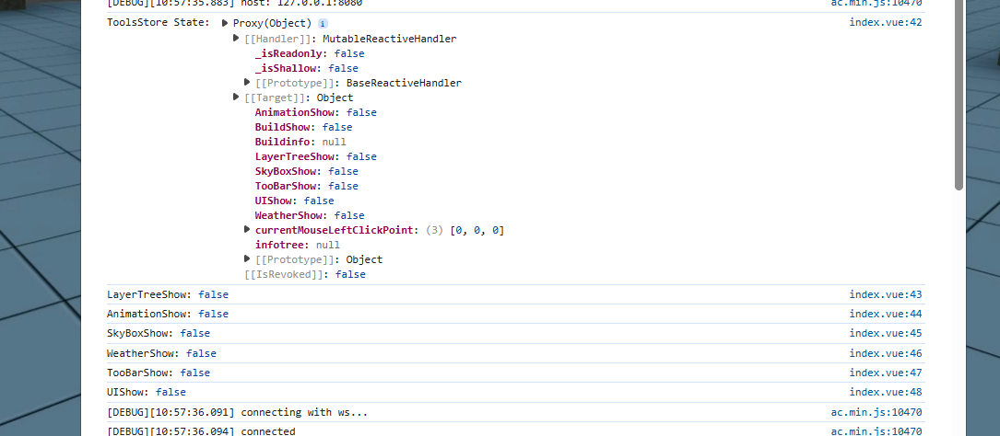
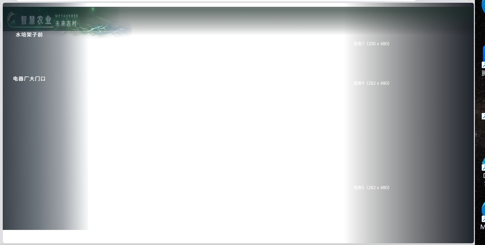
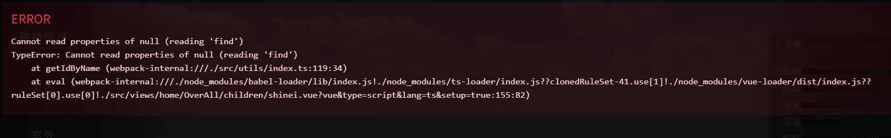

导航页框架搭建。

## 使用pinia管理状态

### 安装

```bash
npm install pinia
```

### 创建store

直接复制开源项目

```ts
import { defineStore } from 'pinia';

// 定义一个通用的 Pinia store 模板
export const useGenericStore = defineStore(
    'generic', // 第一个参数：id，可以根据需要修改
    {
        state: () => ({
            // 示例 state，可以根据需要替换
            exampleState1: false,
            exampleState2: null,
            exampleState3: false,
        }),
        actions: {
            /**
             * 示例 action，可以根据需要替换
             * @param payload
             */
            setExampleState1(payload: boolean) {
                this.exampleState1 = payload;
            },
            ...
        }
    }
);
```

### 使用

### mian.ts

```ts
import { createApp } from 'vue'
import { createPinia } from 'pinia'   // 引入pinia
import App from './App.vue'
import './registerServiceWorker'
import router from './router/index'


const app = createApp(App)
const pinia = createPinia()   // 创建pinia实例

createApp(App)
    .use(pinia)   // 使用pinia实例
    .use(router)
    .mount('#app')
```

### 组件中使用

```ts
// 导入工具状态管理仓库
import { useToolsStore } from '@/stores/tools'
// 获取工具状态管理仓库实例
const ToolsStore = useToolsStore()

// 计算图层树显示状态
const LayerTreeShow = computed(() => ToolsStore.$state.LayerTreeShow)
// 计算动画显示状态
const AnimationShow = computed(() => ToolsStore.$state.AnimationShow)
...
```

## 实现效果

+ 这个一直报错说找不到路径
```ts
// 导入工具状态管理仓库
import { useToolsStore } from '@/stores/tools'
```



目前效果：区域定位完成.


## 遇到问题

### Cannot read properties of null



### runtime-core.esm-bundler.js:51  [Vue warn]: Failed to resolve component: Icon

控制台一直弹出

```
runtime-core.esm-bundler.js:51  [Vue warn]: Failed to resolve component: Icon
```

这个问题很奇怪，只要在 `main.ts` 中全局注册了 `Icon` 组件，就解决。

```
 .component("Icon", Icon)
```


需要引入这两个文件

```html
<script src="/js/jquery-3.5.0.min.js"></script>
<script src="/js/rotation3D//rotation3D.js"></script>
<script src="/js/iconfont_default.js"></script>
```

### __g.camera.get() error

这个必须要使用　＜player＞　组件才可以

原因: 我之前是 `console.log(__g.camera.get())`

人家是`console.log(__g.camera.get)`

### 获取城市ID不正确

获取城市 ID 失败或返回格式不正确: 

###　室内

添加了`drag.ts`，并且全局注册。


###　总是出现链接不上的错误

好像只需要稳稳地连上服务器，有画面渲染，就不会报错了．

###　点击｀风机控制｀没有一点反应

出现的条件有两个，之前一直没有修改 tag 属性，所以导致判断失误。

```
  v-if="dialogStore.dialogVisible && dialogStore.tag === '排风扇2'"
  tag="排风扇2"
```

### 图例设计

┌────────────────────────────┐
│        环境监测数据        │
├────────────────────────────┤
│ 📦 空气信息                │
│  • 温度：23.5°C            │
│  • 湿度：60%               │
│                            │
│ 🌱 土壤信息                │
│  • 温度：18.2°C            │
│  • 电导率：0.9 ms/cm       │
│  • PH：6.8                 │
│  • 氮 (N)：45 ppm          │
│  • 磷 (P)：12 ppm          │
│  • 钾 (K)：33 ppm          │
└────────────────────────────┘

很好，但是我想要结合一些 折线图和柱状图之类的，所以你应该给我挑选出哪些时只需要简单显示哪些需要用图例显示，如果你觉得血药用按钮之类的也可以提出来


┌───────────────┐
│ 空气信息 [折线图] │
│ - 温度趋势图   │
│ - 湿度趋势图   │
├───────────────┤
│ 土壤温度趋势图 │
│ 电导率趋势图   │
├───────────────┤
│ 土壤养分柱状图  │
│ - N  P  K     │
├───────────────┤
│ 📋 其他静态参数     │
│ - PH：6.8 （偏中性）│
└───────────────┘

好的但是我的空间有限，我想的是如果显示空气的信息，就只显示温度和湿度，就折叠土地的内容，但是显示当前土地温度，电导率，养分，ph不过不显示趋势题，就是简单显示静态数据，


项目 | 展示方式 | 说明
NPK | 柱状图 | 直观展示比例，可设上下限参考线
pH | 仪表盘 or 彩条卡片 | 区分酸碱中性，直观好看
电导率 | 折线图 | 可添加预警色条、单位
温度 | 折线图 | 色彩变化或简易温度


